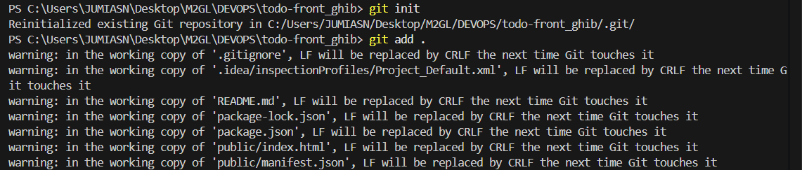
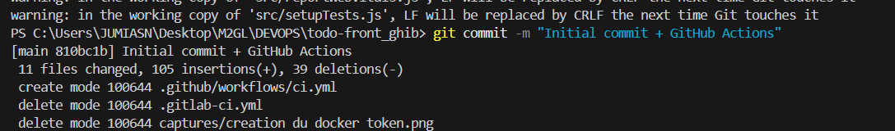
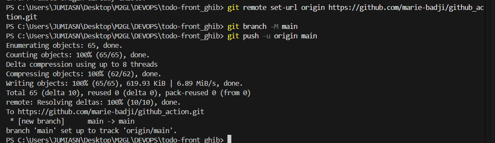
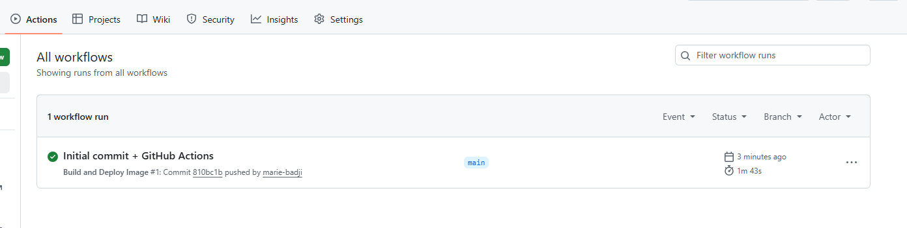
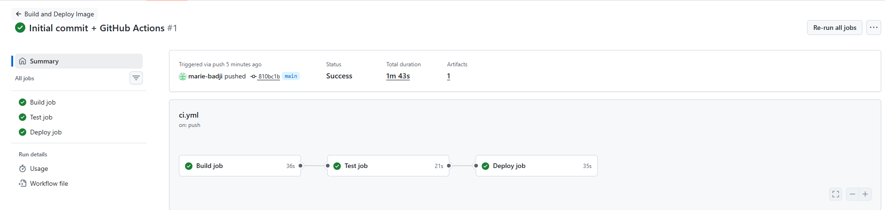

# todo-front — Pipeline CI/CD avec GitHub Actions

> Application React de gestion de tâches déployée via une pipeline CI/CD complète sur GitHub Actions.

---

## Sommaire

- [Présentation du projet](#présentation-du-projet)
- [Technologies utilisées](#technologies-utilisées)
- [Structure du projet](#structure-du-projet)
- [Étapes de mise en place](#étapes-de-mise-en-place)
- [Pipeline CI/CD](#pipeline-cicd)
- [Variables d'environnement](#variables-denvironnement)
- [Lancer le projet en local](#lancer-le-projet-en-local)
- [Différence CI vs CD](#différence-ci-vs-cd)
- [Auteur](#auteur)

---

## Présentation du projet

Ce projet est une application **React** de gestion de tâches (Todo App). Il a été conçu dans le cadre d'un TP DevOps pour mettre en place une **pipeline CI/CD complète** avec GitHub Actions.

L'objectif principal est la mise en place de l'automatisation du build, des tests et du déploiement via **GitHub Actions** et **Docker Hub**.

---

## Technologies utilisées

| Technologie | Rôle |
|-------------|------|
| **React** | Framework front-end |
| **npm** | Gestionnaire de paquets |
| **GitHub Actions** | Pipeline d'intégration et de déploiement continus |
| **Docker** | Conteneurisation de l'application |
| **Docker Hub** | Registry pour stocker l'image Docker |
| **Nginx** | Serveur web pour servir l'application en production |

---

## Structure du projet

```
todo-front/
├── .github/
│   └── workflows/
│       └── ci.yml          # Configuration GitHub Actions
├── Dockerfile               # Image Docker multi-stage (build + serve)
├── nginx.conf               # Configuration du serveur Nginx
├── public/                  # Fichiers statiques publics
├── src/                     # Code source React
│   ├── App.js
│   ├── App.test.js
│   └── index.js
├── package.json             # Dépendances npm
└── README.md                # Documentation du projet
```


## Pipeline CI/CD

La pipeline est définie dans `.github/workflows/ci.yml` et se compose de **3 jobs**.

```
push → [Build job] → [Test job] → [Deploy job]
```

### Job 1 — Build
- Checkout du code source
- Installation de Node.js 18
- Installation des dépendances avec `npm install`
- Build de l'application React avec `npm run build`
- Upload de l'artifact `package-final` (dossier `build/`)

### Job 2 — Test
- Dépend du job `build` (`needs: build`)
- Installation des dépendances
- Exécution des tests unitaires avec `npm test`
- `continue-on-error: true` : ne bloque pas le pipeline

### Job 3 — Deploy
- Dépend des jobs `build` et `check-tests` (`needs: [build, check-tests]`)
- Download de l'artifact généré par le job build
- Build de l'image Docker via le `Dockerfile`
- Connexion à Docker Hub avec les secrets sécurisés
- Push de l'image : `DOCKER_HUB_USER/todo-front:latest`

### Fichier `.github/workflows/ci.yml`

```yaml
name: Build and Deploy Image

on: [push]

jobs:
  build:
    name: Build job
    runs-on: ubuntu-latest
    steps:
      - name: Checkout code
        uses: actions/checkout@v4
      - name: Set up Node.js
        uses: actions/setup-node@v4
        with:
          node-version: '18'
          cache: 'npm'
      - name: Install dependencies
        run: npm install --force
      - name: Build React app
        run: npm run build
      - name: Create directory for uploading artifacts
        run: mkdir staging && cp -r build/* staging
      - name: Upload artifacts
        uses: actions/upload-artifact@v4
        with:
          name: package-final
          path: staging
          if-no-files-found: error
          retention-days: 5
      - name: Show uploaded artifacts
        run: ls staging/
      - run: echo "🍏 This job's status is ${{ job.status }}."

  check-tests:
    name: Test job
    needs: build
    runs-on: ubuntu-latest
    steps:
      - name: Checkout code
        uses: actions/checkout@v4
      - name: Set up Node.js
        uses: actions/setup-node@v4
        with:
          node-version: '18'
          cache: 'npm'
      - name: Install dependencies
        run: npm install --force
      - name: Run unit tests
        run: npm test -- --watchAll=false --passWithNoTests
        continue-on-error: true
      - run: echo "🍏 This job's status is ${{ job.status }}."

  deploy:
    name: Deploy job
    needs: [build, check-tests]
    runs-on: ubuntu-latest
    steps:
      - name: Checkout code
        uses: actions/checkout@v4
      - name: Download artifact from build job
        uses: actions/download-artifact@v4
        with:
          name: package-final
      - name: Show downloaded artifacts directory
        run: pwd && ls .
      - name: Build Docker image
        run: docker build --no-cache -t ${{ secrets.DOCKER_HUB_USER }}/todo-front:latest .
      - name: Show Docker images
        run: docker image ls
      - name: Login to Docker Hub
        run: docker login -u ${{ secrets.DOCKER_HUB_USER }} -p ${{ secrets.DOCKER_HUB_TOKEN }}
      - name: Push image to Docker Hub
        run: docker push ${{ secrets.DOCKER_HUB_USER }}/todo-front:latest
      - run: echo "🍏 This job's status is ${{ job.status }}."
```

---

## Dockerfile

Image **multi-stage** pour une image finale légère :

```dockerfile
# Stage 1 : Build
FROM node:18-alpine AS build
WORKDIR /app
COPY package*.json ./
RUN npm install --force
COPY . .
RUN npm run build

# Stage 2 : Serve avec Nginx
FROM nginx:stable-alpine
COPY --from=build /app/build /usr/share/nginx/html
COPY nginx.conf /etc/nginx/conf.d/default.conf
EXPOSE 80
CMD ["nginx", "-g", "daemon off;"]
```

---

## Variables d'environnement

Les secrets sont stockés dans **Settings → Secrets and variables → Actions** du repo GitHub.

| Secret | Description |
|--------|-------------|
| `DOCKER_HUB_USER` | Pseudo Docker Hub |
| `DOCKER_HUB_TOKEN` | Token d'accès Docker Hub (Read & Write) |

---

### Ajouter les secrets dans GitHub

Les secrets `DOCKER_HUB_USER` et `DOCKER_HUB_TOKEN` sont ajoutés dans **Settings → Secrets and variables → Actions → New repository secret**.

**Secret DOCKER_HUB_USER :**


**Secret DOCKER_HUB_TOKEN :**


**Vue des secrets configurés :**


---
### Initialiser le dépôt Git et faire le premier commit

Initialisation du dépôt Git local, ajout de tous les fichiers du projet.



---

### Commit du projet avec le fichier GitHub Actions

Création du commit incluant le fichier `.github/workflows/ci.yml`.



---

### Lier le dépôt GitHub et pusher

Configuration du remote GitHub puis push du code sur la branche `main`.



---

### Pipeline exécutée avec succès

La pipeline se déclenche automatiquement à chaque push. Les 3 jobs s'enchaînent et passent au vert en **1m 43s**.



---

### Détail des jobs

Chaque job s'exécute dans l'ordre : `Build job` → `Test job` → `Deploy job`.



---

## Lancer le projet en local

```bash
# Cloner le projet
git clone https://github.com/marie-badji/github_action.git
cd github_action

# Installer les dépendances
npm install

# Lancer en mode développement
npm start
```

### Avec Docker

```bash
docker build -t todo-front .
docker run -p 80:80 todo-front
```

---

## Différence CI vs CD

| Concept | Description | Dans ce projet |
|---------|-------------|----------------|
| **CI** (Intégration Continue) | Build et tests automatiques à chaque push | Jobs `build` et `check-tests` |
| **CD** (Livraison Continue) | Image Docker prête sur Docker Hub | Job `deploy` |
| **CD** (Déploiement Continu) | Déploiement automatique sur un serveur | Non configuré (hors scope du TP) |

---

## Différence GitLab CI vs GitHub Actions

| | **GitLab CI** | **GitHub Actions** |
|---|---|---|
| Fichier | `.gitlab-ci.yml` | `.github/workflows/ci.yml` |
| Syntaxe | `stages`, `script:` | `jobs`, `steps:` |
| Secrets | Variables CI/CD | Secrets Actions |
| Deploy | `when: manual` | Automatique après les jobs précédents |

---

## Auteur

**Marie BADJI** — M2GL DevOps  
Dépôt GitHub : [github.com/marie-badji/github_action](https://github.com/marie-badji/github_action)